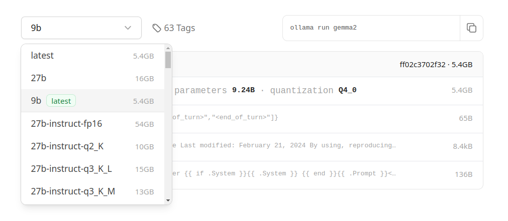
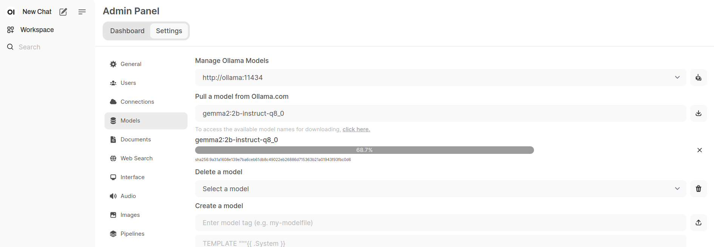

# RiOllama

Chatbot com LLMs locais via [Ollama](https://github.com/ollama/ollama).

Criado usando [Rio](https://github.com/rio-labs/rio), baseado no templete `AI Chatbot`.

Modelos também podem ser usados com a interface [Open WebUI](https://github.com/open-webui/open-webui), 
usado nesse repositório como facilitador no download de modelos. 

## AI Chatbot

Um chat simples com IAs locais via Ollama. Uma demonstração das capacidades do framework Rio.

**Não requer nenhuma senha ou chave de API.**

## Requisitos

- Python 3.11+
- Docker e Compose  

## Execução

- Instalar dependências Python (pip ou poetry)
- Ollama (executado pelo Docker, recomendado)
- Baixar modelos (linha de comando ou Open WebUI)

#### Observação para usuários Windows

* Todas as instruções foram testadas no Linux. Algumas adaptações podem ser necessárias para rodar o 
aplicativo em ambiente Windows. Se você usa Windows, o WSL é recomendado.
* É possível instalar o `make` no Windows, mas não é requisito. Se preferir, acesse o arquivo Makefile, 
observe os comandos usados na receita e adapte para seu ambiente.

### Docker e Compose

* Dependendo do seu SO, use as instruções de instalação do site https://docs.docker.com/get-docker/
* Recomendado a instalação do Docker Engine no Linux (ou WSL) com os comandos abaixo
```shell
curl -fsSL https://get.docker.com -o get-docker.sh
sudo sh ./get-docker.sh --dry-run
```
* Siga as instruções de pós-instalação, se necessário. https://docs.docker.com/engine/install/linux-postinstall/

### Instalar dependências Python

* O comando padrão usa o `poetry` para gerenciar as dependências e a criação do ambiente virtual, 
sendo necessário que ele já esteja instalado.

```shell
make install
```

* Se você não usa `poetry`, crie o ambiente virtual manualmente, ative o ambiente e instale as dependências.
O requirements.txt fornecido no repositório tem as mesmas dependências que o poetry instalaria.

```shell
# Criando uma pasta chama .venv para o ambiente virtual
python -m venv .venv
# Ativando o ambiente virtual
source .venv/bin/activate
# Instalando depdndências
pip install -r requirements.txt
```

* Se você não usa `poetry`, para adaptar as chamadas no Makefile, substitua a variável RUN por esse conteudo,
que usa o caminho completo antes de chamar o interpretador Python: `.venv/bin/python`, conforme exemplo criado acima.

### Executar Ollama (via Docker Compose)

```shell
make run-ollama
```
* A primeira execução pode demorar um pouco, porque as imagens vão ser baixadas.

### Executar RiOllama

* É necessário ter baixado modelos (ver instruções abaixo) e configurado o arquivo .env
com o nome do modelo a ser usado no chat

- roda o aplicativo RiOllama em modo release, para produção

```shell
make run-app-prd
```

- roda o aplicativo RiOllama em modo debug, para desenvolvimento

```shell
make run-app-dev
```

### Instrução para baixar/criar modelos

#### Consultar e escolher modelos disponíveis

https://ollama.com/library

* Lista modelos LLM, quantizados no formato GGUF, já incorporados no acervo do Ollama. 
A quantidade de parâmetros e a quantização determinam o tamanho do modelo a ser baixado. 
* Na página do modelo em específico, a tag selecionada por padrão é a 'latest'.
Nos comandos do Ollama, quando não especificamos uma 'tag' para o modelo, é usado essa tag.
(como no Docker)
* É possível ver todas as tags disponíveis para o modelo abrindo a caixa de seleção à esquerda. 
Clicando-se numa tag o comando à direita é atualizado.

* Para instalar um modelo, é necessário copiar o seu nome com a tag (ou não, se escolher o latest)
e colar na linha de comando (ver abaixo) ou na interface do Open Web UI.
Ex.: phi3, llama3:instruct, gemma2:gemma2:9b-text-q4_K_M, etc
* Para a tag latest, a equipe do Ollama geralmente escolhe um modelo quantizado em 4 bits
com a versão com menos parâmetros do modelo. 
  * Ex.: o modelo _phi3:latest_ corresponde ao _phi3:3.8b-mini-4k-instruct-q4_0_
* Para versões com mais parâmetros ou outra quantização, é necessário adicionar a tag correspondente. 
  * Ex.: _phi3:14b_, _phi3:14b-medium-4k-instruct-q8_0_
* Recomendado procurar modelos que se ajustem aos recursos disponíveis. O tamanho da memória do computador
(RAM + VRAM, se houver) vai determinar a performance de respostas. Faça testes, começando com os menores 
(tinyllama, por exemplo), até conseguir adequar os recursos aos modelos e às respostas esperadas.

#### Baixar modelos utilizando linha de comando

```shell
docker compose exec -it ollama bash
# ollama pull <nome do modelo, com tag se necessário>
ollama pull llama3:instruct
ollama pull phi3:instruct
```

#### Baixar modelos utilizando Open Web UI

* Executar Open WebUI (via Docker Compose)
```shell
make run-ui
```
* A primeira execução pode demorar um pouco, porque as imagens vão ser baixadas.
* Com o Open WebUI iniciado, visite http://localhost:3000
* Clique em _Sign Up_ para criar a primeira conta local
* Coloque seus dados para criar a conta. O primeiro usuário criado será também Administrador
* Na aba lateral esquerda, onde seu nome de usuário é apresentado, clique no nome e escolha _Admin Panel_
* Em seguida escolha _Settings_ e _Models_
* No campo _Pull a model from Ollama.com_ cole o nome do modelo com a tag, se houver
* Clique no ícone de Download, no final desse campo
* Aguarde o modelo ser baixado
* Após baixar pelo menos um modelo, é possível usar a interface do Open Web UI para conversar com o modelo
* Explore as opções e saiba mais sobre a plataforma



#### Criar modelo baseado no Hugging Face

